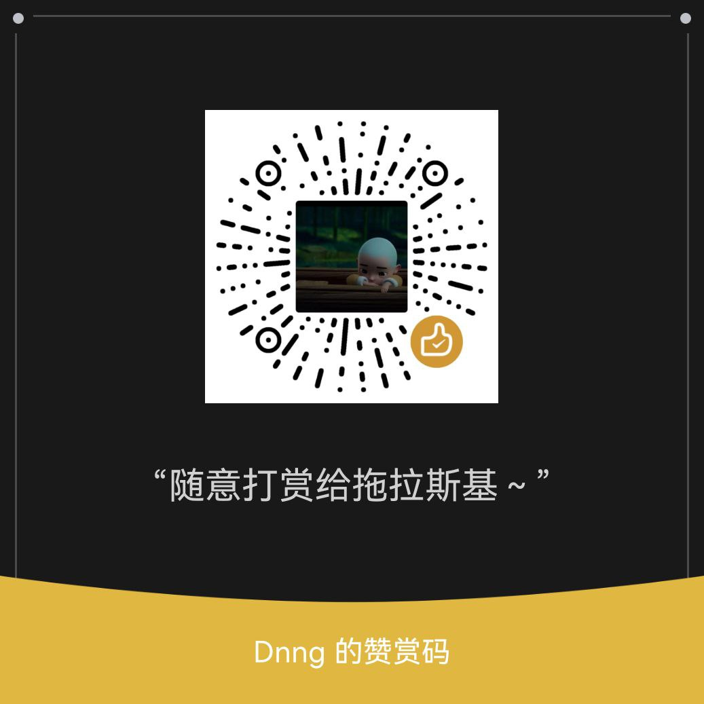

# RenXing
脚本仅供参考，请在24小时内删除本项目<br>
本仓库建立在     芝士ql spy   功能上<br>
脚本全部来源于  Faker，环境，KR，YYDS，锦鲤偷撸库  未删减<br><br>
## 拉库命令<br>库中包含test_|me_自用脚本（默认拉库命令只包含人形所需脚本）
```Bash
ql repo https://ghproxy.com/https://github.com/SnowTlsj/RenXing.git "jd_|pkc_|jdCookie.js" "" "^jd[^_]|USER|function|utils|sendNotify"
```
### 拉库参数详情
| jd_\|pkc_\|jdCookie.js               | 普通监控 |
|--------------------------------------|----------|
| jd_\|pkc_\|kanjia_\|jdCookie.js      | 增加砍价 |
| jd_\|pkc_\|kanjia_\|me_\|jdCookie.js | 增加试用 |
## 监控变量<br>请自行替换全部 F5Gr05mpZGS_","ON6dMGX-m9UN 部分为自己的Clients<br>set jd_cookie env_listens <修改后的变量值>
```Bash
[{"ID":0,"UUID":"e9556a8f-b290-11ec-be47-00163e16f57e","Name":"豆车","Keyword":"SnowTlsj_RenXing/jd_cjzdgf","Envs":["jd_cjhy_activityId"],"Disable":false,"Clients":["F5Gr05mpZGS_","ON6dMGX-m9UN"],"Interval":0,"MaxRuntime":0,"Mode":false},{"ID":0,"UUID":"e9556ae4-b290-11ec-be47-00163e16f57e","Name":"zdjr","Keyword":"SnowTlsj_RenXing/jd_zdjr.js","Envs":["jd_zdjr_activityId"],"Disable":false,"Clients":["F5Gr05mpZGS_","ON6dMGX-m9UN"],"Interval":0,"MaxRuntime":0,"Mode":false},{"ID":0,"UUID":"e9556ae7-b290-11ec-be47-00163e16f57e","Name":"半点京豆雨","Keyword":"SnowTlsj_RenXing/jd_redrain_half.js","Envs":["jd_redrain_half_url"],"Disable":false,"Clients":["F5Gr05mpZGS_","ON6dMGX-m9UN"],"Interval":0,"MaxRuntime":0,"Mode":false},{"ID":0,"UUID":"e9556aec-b290-11ec-be47-00163e16f57e","Name":"店铺签到","Keyword":"HarbourJ_HarbourToulu_main/jd_dpqd.js","Envs":["DPQDTK"],"Disable":false,"Clients":["F5Gr05mpZGS_","ON6dMGX-m9UN"],"Interval":0,"MaxRuntime":0,"Mode":false},{"ID":0,"UUID":"e9556b6d-b290-11ec-be47-00163e16f57e","Name":"女装盲盒","Keyword":"SnowTlsj_RenXing/jd_nzmh.js","Envs":["jd_nzmhurl"],"Disable":false,"Clients":["F5Gr05mpZGS_","ON6dMGX-m9UN"],"Interval":0,"MaxRuntime":0,"Mode":false},{"ID":0,"UUID":"e9556b71-b290-11ec-be47-00163e16f57e","Name":"打豆豆","Keyword":"SnowTlsj_RenXing/jd_wxgame.js","Envs":["jd_wxgame_activityId"],"Disable":false,"Clients":["F5Gr05mpZGS_","ON6dMGX-m9UN"],"Interval":0,"MaxRuntime":0,"Mode":false},{"ID":0,"UUID":"e9556b75-b290-11ec-be47-00163e16f57e","Name":"众筹许愿池","Keyword":"SnowTlsj_RenXing/jd_wish.js","Envs":["wish_appIdArrList","wish_appNameArrList"],"Disable":false,"Clients":["F5Gr05mpZGS_","ON6dMGX-m9UN"],"Interval":0,"MaxRuntime":0,"Mode":false},{"ID":0,"UUID":"e9556b78-b290-11ec-be47-00163e16f57e","Name":"微定制","Keyword":"SnowTlsj_RenXing/jd_wdz.js","Envs":["jd_wdz_activityId"],"Disable":false,"Clients":["F5Gr05mpZGS_","ON6dMGX-m9UN"],"Interval":0,"MaxRuntime":0,"Mode":false},{"ID":0,"UUID":"e9556b7c-b290-11ec-be47-00163e16f57e","Name":"盲盒任务抽京豆","Keyword":"SnowTlsj_RenXing/jd_mhtask.js","Envs":["jd_mhurlList"],"Disable":false,"Clients":["F5Gr05mpZGS_","ON6dMGX-m9UN"],"Interval":0,"MaxRuntime":0,"Mode":false},{"ID":0,"UUID":"e9556b7f-b290-11ec-be47-00163e16f57e","Name":"入会开卡","Keyword":"SnowTlsj_RenXing/jd_OpenCard_Force.js","Envs":["VENDER_ID"],"Disable":false,"Clients":["F5Gr05mpZGS_","ON6dMGX-m9UN"],"Interval":0,"MaxRuntime":0,"Mode":false},{"ID":0,"UUID":"fab25468-ce80-11ec-89ab-00163e16f57e","Name":"大牌通用开卡","Keyword":"SnowTlsj_RenXing/jd_opencardDPLHTY.js","Envs":["DPLHTY"],"Disable":false,"Clients":["F5Gr05mpZGS_","ON6dMGX-m9UN"],"Interval":0,"MaxRuntime":0,"Mode":false},{"ID":0,"UUID":"3d7f3f6f-ce8b-11ec-89ab-00163e16f57e","Name":"皮卡车","Keyword":"SnowTlsj_RenXing/pkc_gzyl.js","Envs":["PKC_GZYL"],"Disable":false,"Clients":["F5Gr05mpZGS_","ON6dMGX-m9UN"],"Interval":0,"MaxRuntime":0,"Mode":false},{"ID":0,"UUID":"6abc81ba-ce8b-11ec-89ab-00163e16f57e","Name":"皮卡车","Keyword":"SnowTlsj_RenXing/pkc_txgzyl.js","Envs":["PKC_TXGZYL"],"Disable":false,"Clients":["F5Gr05mpZGS_","ON6dMGX-m9UN"],"Interval":0,"MaxRuntime":0,"Mode":false},{"ID":0,"UUID":"6082bcf8-d6d3-11ec-9369-00163e16f57e","Name":"读秒拼手速","Keyword":"SnowTlsj_RenXing/jd_wxSecond","Envs":["jd_wxSecond_activityId"],"Disable":false,"Clients":["F5Gr05mpZGS_","ON6dMGX-m9UN"],"Interval":0,"MaxRuntime":0,"Mode":false},{"ID":0,"UUID":"4d228ae5-d754-11ec-bc7e-00163e16f57e","Name":"分享有礼","Keyword":"SnowTlsj_RenXing/jd_share.js","Envs":["jd_fxyl_activityId"],"Disable":false,"Clients":["F5Gr05mpZGS_","ON6dMGX-m9UN"],"Interval":0,"MaxRuntime":0,"Mode":false},{"ID":0,"UUID":"d764af9b-dca2-11ec-977e-00163e16f57e","Name":"超级无线店铺签到","Keyword":"HarbourJ_HarbourToulu_main/jd_sevenDay","Envs":["SEVENDAY_LIST","SEVENDAY_LIST2"],"Disable":false,"Clients":["F5Gr05mpZGS_","ON6dMGX-m9UN"],"Interval":0,"MaxRuntime":0,"Mode":false},{"ID":0,"UUID":"a50bd897-dea3-11ec-8127-00163e16f57e","Name":"618个护","Keyword":"SnowTlsj_RenXing/jd_lottery.js","Envs":["JD_Lottery"],"Disable":false,"Clients":["F5Gr05mpZGS_","ON6dMGX-m9UN"],"Interval":0,"MaxRuntime":0,"Mode":false},{"ID":0,"UUID":"e0714485-dff9-11ec-9ceb-00163e16f57e","Name":"joy通用开卡","Keyword":"SnowTlsj_RenXing/jd_joyopen.js","Envs":["JD_JOYOPEN"],"Disable":false,"Clients":["F5Gr05mpZGS_","ON6dMGX-m9UN"],"Interval":0,"MaxRuntime":0,"Mode":false},{"ID":0,"UUID":"5a968181-e4f0-11ec-814d-000c29c6b2c5","Name":"分享有礼share","Keyword":"SnowTlsj_RenXing/jd_share2.js","Envs":["SHARE_ACTIVITY_ID"],"Disable":false,"Clients":["F5Gr05mpZGS_","ON6dMGX-m9UN"],"Interval":0,"MaxRuntime":0,"Mode":false},{"ID":0,"UUID":"7d4a4ace-e5ff-11ec-98ca-000c29aee10b","Name":"lz刮刮乐抽奖通用活动","Keyword":"SnowTlsj_RenXing/jd_drawCenter","Envs":["jd_drawCenter_activityId"],"Disable":false,"Clients":["F5Gr05mpZGS_","ON6dMGX-m9UN"],"Interval":0,"MaxRuntime":0,"Mode":false},{"ID":0,"UUID":"9a59922d-fa78-11ec-9a04-000c2994a223","Name":"LZ关注抽奖","Keyword":"SnowTlsj_RenXing/jd_wxShopFollowActivity.js","Envs":["jd_wxShopFollowActivity_activityId"],"Disable":false,"Clients":["F5Gr05mpZGS_","ON6dMGX-m9UN"],"Interval":0,"MaxRuntime":0,"Mode":false},{"ID":0,"UUID":"0ace85cd-fabf-11ec-b56d-000c2994a223","Name":"邀请有礼","Keyword":"SnowTlsj_RenXing/jd_yqhy.py","Envs":["yhyactivityId"],"Disable":false,"Clients":["F5Gr05mpZGS_","ON6dMGX-m9UN"],"Interval":0,"MaxRuntime":0,"Mode":false},{"ID":0,"UUID":"fab490d3-fac0-11ec-9f60-000c2994a223","Name":"粉丝互动通用","Keyword":"SnowTlsj_RenXing/jd_wxFansInterActionActivity.js","Envs":["jd_wxFansInterActionActivity_activityId"],"Disable":false,"Clients":["F5Gr05mpZGS_","ON6dMGX-m9UN"],"Interval":0,"MaxRuntime":0,"Mode":false},{"ID":0,"UUID":"a43a662b-fdf7-11ec-93da-000c2994a223","Name":"邀请有礼code","Keyword":"SnowTlsj_RenXing/jd_yqhy.py","Envs":["yhyauthorCode"],"Disable":false,"Clients":["F5Gr05mpZGS_","ON6dMGX-m9UN"],"Interval":0,"MaxRuntime":0,"Mode":false},{"ID":0,"UUID":"a1a95dd6-0042-11ed-82d8-000c2994a223","Name":"邀好友赢大礼","Keyword":"HarbourJ_HarbourToulu_main/jd_inviteFriendsGift.py","Envs":["jd_inv_authorCode"],"Disable":false,"Clients":["F5Gr05mpZGS_","ON6dMGX-m9UN"],"Interval":0,"MaxRuntime":0,"Mode":false},{"ID":0,"UUID":"29d5a6d6-0360-11ed-ab62-000c2994a223","Name":"砍价免费拿(默认拉库命令不含)","Keyword":"SnowTlsj_RenXing/kanjia_kanja.js","Envs":["actId","packetId"],"Disable":false,"Clients":["F5Gr05mpZGS_","ON6dMGX-m9UN"],"Interval":0,"MaxRuntime":0,"Mode":false},{"ID":0,"UUID":"88ed62a4-0361-11ed-b165-000c2994a223","Name":"LZ让福袋飞","Keyword":"SnowTlsj_RenXing/jd_wxUnPackingActivity.js","Envs":["jd_wxUnPackingActivity_activityId"],"Disable":false,"Clients":["F5Gr05mpZGS_","ON6dMGX-m9UN"],"Interval":0,"MaxRuntime":0,"Mode":false},{"ID":0,"UUID":"b944233c-04e7-11ed-afca-000c2994a223","Name":"LZ加购有礼","Keyword":"SnowTlsj_RenXing/jd_lzaddCart.js","Envs":["jd_lzaddCart_activityId"],"Disable":false,"Clients":["F5Gr05mpZGS_","ON6dMGX-m9UN"],"Interval":0,"MaxRuntime":0,"Mode":false},{"ID":0,"UUID":"b09eaa60-04e9-11ed-afca-000c2994a223","Name":"幸运抽大奖通用","Keyword":"SnowTlsj_RenXing/jd_wxDrawActivity.js","Envs":["jd_wxDrawActivity_Url"],"Disable":false,"Clients":["F5Gr05mpZGS_","ON6dMGX-m9UN"],"Interval":0,"MaxRuntime":0,"Mode":false},{"ID":0,"UUID":"df75a8db-0667-11ed-b432-000c2994a223","Name":"LZ购物车锦鲤","Keyword":"SnowTlsj_RenXing/jd_wxCartKoi.js","Envs":["jd_wxCartKoi_activityId"],"Disable":false,"Clients":["F5Gr05mpZGS_","ON6dMGX-m9UN"],"Interval":0,"MaxRuntime":0,"Mode":false},{"ID":0,"UUID":"38f1cfb1-15a1-11ed-b172-000c2994a223","Name":"cjhy幸运抽大奖","Keyword":"SnowTlsj_RenXing/jd_cjhy_wxDrawActivity.js","Envs":["jd_cjhy_wxDrawActivity_Id"],"Disable":false,"Clients":["F5Gr05mpZGS_","ON6dMGX-m9UN"],"Interval":0,"MaxRuntime":0,"Mode":false},{"ID":0,"UUID":"7c6ac346-15a1-11ed-afac-000c2994a223","Name":"微定制福袋","Keyword":"SnowTlsj_RenXing/jd_wdzfd.js","Envs":["jd_wdzfd_activityId"],"Disable":false,"Clients":["F5Gr05mpZGS_","ON6dMGX-m9UN"],"Interval":0,"MaxRuntime":0,"Mode":false},{"ID":0,"UUID":"71e80874-16d0-11ed-ad8c-000c2994a223","Name":"cjhy加购抽奖","Keyword":"SnowTlsj_RenXing/jd_cjhy_wxCollectionActivity.js","Envs":["jd_cjhy_wxCollectionActivityId"],"Disable":false,"Clients":["F5Gr05mpZGS_","ON6dMGX-m9UN"],"Interval":0,"MaxRuntime":0,"Mode":false},{"ID":0,"UUID":"a8a78f84-16d0-11ed-ad8c-000c2994a223","Name":"lzkj幸运抽奖","Keyword":"SnowTlsj_RenXing/jd_lzkj_wxDrawActivity.js","Envs":["jd_lzkj_wxDrawActivity_Id"],"Disable":false,"Clients":["F5Gr05mpZGS_","ON6dMGX-m9UN"],"Interval":0,"MaxRuntime":0,"Mode":false},{"ID":0,"UUID":"de70dbb0-16d0-11ed-ad8c-000c2994a223","Name":"lzkj加购抽奖","Keyword":"SnowTlsj_RenXing/jd_lzkj_wxCollectionActivity.js","Envs":["jd_lzkj_wxCollectionActivityId"],"Disable":false,"Clients":["F5Gr05mpZGS_","ON6dMGX-m9UN"],"Interval":0,"MaxRuntime":0,"Mode":false},{"ID":0,"UUID":"c29743c0-16d1-11ed-ad8c-000c2994a223","Name":"幸运抽奖通用","Keyword":"SnowTlsj_RenXing/jd_luck_draw.js","Envs":["LUCK_DRAW_URL"],"Disable":false,"Clients":["F5Gr05mpZGS_","ON6dMGX-m9UN"],"Interval":0,"MaxRuntime":0,"Mode":false},{"ID":0,"UUID":"bd50baa6-1f82-11ed-b409-0242ac110003","Name":"关注有礼","Keyword":"SnowTlsj_RenXing/jd_follow.js","Envs":["M_FOLLOW_SHOP_ARGV"],"Disable":false,"Clients":["F5Gr05mpZGS_","ON6dMGX-m9UN"],"Interval":0,"MaxRuntime":0,"Mode":false},{"ID":0,"UUID":"16cda451-206e-11ed-b62b-0242ac110002","Name":"jinggeng邀请入会有礼","Keyword":"HarbourJ_HarbourToulu_main/jd_jinggengInvite.py","Envs":["jinggengInviteJoin"],"Disable":false,"Clients":["F5Gr05mpZGS_","ON6dMGX-m9UN"],"Interval":0,"MaxRuntime":0,"Mode":false},{"ID":0,"UUID":"16sdf45f-206e-11ed-b62b-0242ac110002","Name":"分享有礼","Keyword":"SnowTlsj_RenXing/jd_wxShareActivity.js","Envs":["jd_wxShareActivity_activityId"],"Disable":false,"Clients":["F5Gr05mpZGS_","ON6dMGX-m9UN"],"Interval":0,"MaxRuntime":0,"Mode":false},{"ID":0,"UUID":"dfae0545-23c4-11ed-9203-0242ac110002","Name":"特效关注有礼（同皮卡车）","Keyword":"HarbourJ_HarbourToulu_main/jd_wxShopGift.py","Envs":["jd_wxShopGiftId"],"Disable":false,"Clients":["F5Gr05mpZGS_","ON6dMGX-m9UN"],"Interval":0,"MaxRuntime":0,"Mode":false},{"ID":0,"UUID":"dfae0545-23c4-11ed-4567-0242ac110002","Name":"加购有礼 · 超级无线","Keyword":"SnowTlsj_RenXing/jd_wxCollectionActivity.js","Envs":["jd_wxCollectionActivity_activityUrl"],"Disable":false,"Clients":["F5Gr05mpZGS_","ON6dMGX-m9UN"],"Interval":0,"MaxRuntime":0,"Mode":false}]
```
### 监控变量部分详情
| Name    | 监控名字   |
|---------|------------|
| Keyword | 脚本名字   |
| Envs    | 监控变量   |
| Clients | 青龙应用ID |
## 默认变量<br>写入配置文件config.sh，替换jd_xxxx为自己的pin值
```Bash
export yhypin="jd_xxxxxxxx"
export jd_wdz_pin="jd_xxxxxxxx"
export OWN_COOKIE_NUM="20"
export LUCK_DRAW_NOTIFY="true"
export jd_wxShareActivity_helpnum="20"
export jd_wdz_activityUrl="https://cjhydz-isv.isvjcloud.com"
export jd_cjhy_activityUrl="https://cjhydz-isv.isvjcloud.com"
export jd_zdjr_activityUrl="https://lzkjdz-isv.isvjcloud.com"
export jd_wdzfd_activityUrl="https://cjhydz-isv.isvjcloud.com"
export InviterPin="rlNJtSzYPmUgCq3ezx1BJpWETmKazT8G6C/PnbRdEzA=" ##你的邀请码
```
## 所需依赖-js
```Bash
png-js
date-fns
axios
dotenv
got
crypto-js
md5
ts-md5
tslib
@types/node
request
tough-cookie
jsdom
download
tunnel
ws
js-base64
qrcode-terminal
moment
ds
```
## 所需依赖-py
```Bash
requests
canvas
ping3
jieba
redis
bs4
```
### 赞赏设置

